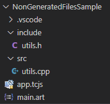

You can include regular, non-generated, C++ files in a build. This can be useful whenever you need to include some C++ code in your application that doesn't naturally belong to any particular Art element. For example, you can write utility functions or types in regular C++ files and then use these functions and types from any Art element in the application.

All files with the file extension `.cpp` that are present in a workspace folder, or in a subfolder of the workspace folder, are assumed to be C++ source files and will be compiled together with generated C++ files. They will be compiled with the same compiler flags as are used for generated C++ files, and resulting object files will be placed in the target folder (in the same subfolder hierarchy as in the workspace folder).

All files with the file extension `.h` that are present in a workspace folder, or in a subfolder of the workspace folder, are assumed to be C++ header files. The folders where they are located will be added automatically to the [inclusionPaths](transformation-configurations.md#inclusionpaths) property so they will be found by the preprocessor.

As an example, let's assume we have a workspace folder with the following structure:



The file `utils.h` contains declarations of some utility functions, and `utils.cpp` contains their implementations. To use one of these utility functions from `main.art` you just need to include the header file. For example:

```art
capsule Main {
    [[rt::impl_preface]]
    `
        #include <iostream>
        #include "utils.h" // Automatically added to inclusion paths
    `

    statemachine {
        state S1;
        initial -> S1
        `
            std::string str("Hello ");
            concat_string(str, "World!"); // Utility function defined in utils.cpp
            std::cout << str << std::endl;
        `;
    };
};
```

It's recommended to place C++ source files in subfolders as in the example above. If you place them directly in the workspace folder you need to ensure they don't have the same name as any of the Art elements that are built. This is to ensure there are no name clashes between the object files that are produced when building.

## Excluding Source Files
By default all `.cpp` and `.h` files that are found in a workspace folder, or in a folder that is directly or indirectly contained in the workspace folder, will be included in the build. If you want to exclude some of these files from the build you can use the [`sources`](transformation-configurations.md#sources) TC property, just as for Art files. All `.cpp` and `.h` files that match at least one pattern in the [`sources`](transformation-configurations.md#sources) property, and doesn't match an anti-pattern (starting with the character `!`) will be included into the build. 

!!! note
    If you set the [`sources`](transformation-configurations.md#sources) property to explicitly include some specific `.cpp` and `.h` files you also need to specify which `.art` files to include. That is, make sure the specified patterns match all files that should be included in the build (both `.cpp`, `.h` and `.art` files). If you only specify anti-patterns (i.e. files to exclude from the build) you don't need to do this, since by default all files are included except the ones that are excluded.

Here are some examples:

``` js
tc.sources = ["**/*.cpp", "**/*.h", "*.art"]; // Include all .cpp and .h files from the workspace folder and all its subfolders, and all .art files from the workspace folder. This is the default behavior if the "sources" property is not set.
tc.sources = ["src/utils.cpp", "include/utils.h", "*.art"]; // Include a specific .cpp and .h file into the build
tc.sources = ["!src/utils.cpp", "!include/utils.h"]; // Include all .cpp and .h files except two specific ones (all .art files will be built)
```

If you have set-up the TC to place generated C++ files in a subfolder of the workspace folder, you don't have to exclude them by means of the [`sources`](transformation-configurations.md#sources) TC property. Generated files will always be included in the build exactly once, no matter where they are located. 

## C++ Extension Source Code Analysis
The C++ extension that you use with {$product.name$} makes use of JSON files for knowing how to analyze C++ source code. Such JSON files are automatically generated by the C++ code generator based on information provided in the TC:

* For the [Microsoft C++ extension](https://code.visualstudio.com/docs/languages/cpp) a file called [`c_cpp_properties.json`](https://code.visualstudio.com/docs/cpp/c-cpp-properties-schema-reference) is used
* For the [Clangd extension](https://clangd.llvm.org/) a file called [`compile_commands.json`](https://clang.llvm.org/docs/JSONCompilationDatabase.html) is used

When you add C++ source files to a workspace folder that you want to build together with the Art files it contains, you should also create such a JSON file to enable the C++ extension to also analyze these files. Without doing so, features such as content assist, navigation and hover tooltips will not work when you edit those files. Rather than creating these files manually it's often easiest to copy the ones that are generated by the C++ code generator from the target folder, and then modify them as required. The most important thing to get right is the inclusion paths to make sure the C++ extension is able to find all include files required by a certain C++ source file.